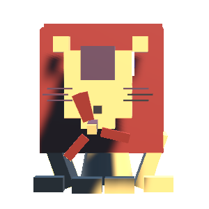

# jsar-gallery-flatten-lion

The flatten lion JSAR widget which is a reimplemetation for this threejs example: [lion](https://codepen.io/Yakudoo/pen/YXxmYR).



## Open

Type the following URL in JSAR runtime:

```sh
https://cdn.jsdelivr.net/gh/M-CreativeLab/jsar-gallery-flatten-lion@main/lib/main.xsml
```

## License

Apache 2.0

